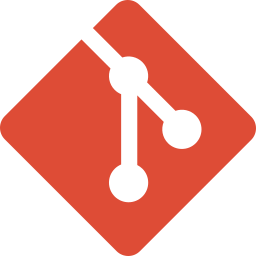

### Hi there 👋

<!--
**abdurrahmankucuk90/abdurrahmankucuk90** is a ✨ _special_ ✨ repository because its `README.md` (this file) appears on your GitHub profile.

Here are some ideas to get you started:

- 🔭 I’m currently working on Finishing my Full Stack Course
- 🌱 I’m currently learning Back-End Django
- 👯 I’m looking to collaborate on ...
- 🤔 I’m looking for help with ...
- 💬 Ask me about React
- 📫 How to reach me: ...
- 😄 Pronouns: ...
- ⚡ Fun fact: ...
-->

## <b>🛠️&nbsp;&nbsp;Languages&nbsp;and&nbsp;Tools&nbsp;&nbsp;🚀</b>

<!--   -->

 
 

 
 
 
 
<a href="https://sass-lang.com/" target="_blank" rel="noreferrer">  
<a href="https://getbootstrap.com/" target="_blank" rel="noreferrer">   

 
 
 
 
   
 
 
 
  
 

## 📈 Statistics
      

&nbsp;
 

 
 ------------
